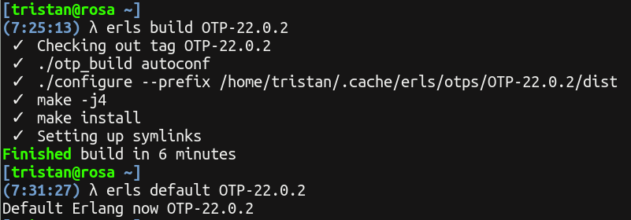

ERLS
=====

Manage multiple Erlang installs with per directory configuration.



## Build

```
$ cargo build --release
```

## Setup

If you download a binary from the github releases you must rename it to `erls` for it to work.

Because `erls` creates symlinks from commands like `erl` to the `erls` binary you must be sure the directory the symlinks are created, `~/.cache/erls/bin`, is in your `PATH`:

```
$ mkdir -p ~/.cache/erls/bin
$ export PATH=~/.cache/erls/bin:$PATH
```

## Build Erlang

`erls` will create a default config under `~/.config/erls/config` if you don't create it yourself and it'll contain:

```
[erls]
dir=<your home>/.cache/erls

[repos]
default=https://github.com/erlang/otp
```

To list tags available to build one:

```
$ erls tags
...
$ erls build OTP-21.2
```

## Configuring Erlang Compilation

To pass options to `./configure` (like for setting where SSL ) you can add them in the config file:

``` ini
[erls]
default_configure_options=--enable-lock-counter
```

Or pass through the env variable `ERLS_CONFIGURE_OPTIONS`:

``` shellsession
$ ERLS_CONFIGURE_OPTIONS=--enable-lock-counter erls build OTP-21.2
```

## Acknowledgements

Inspiration for `erls` is [erln8](https://github.com/metadave/erln8) by Dave Parfitt. He no longer maintains it and I figured I could use writing my own as a way to learn Rust.
